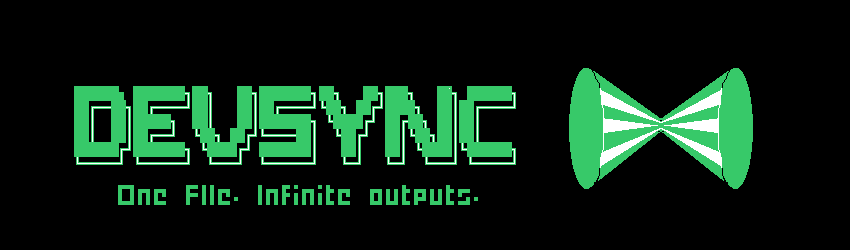

# Devsync

One file, Infinite outputs.

## Social Media

## What is Devsync?

A CLI tool that generates your professional resume, portfolio site, GitHub profile, LinkedIn summary, and academic history — all from a single file.

> **Full documentation, features, and live demo** at [devsync.work](https://devsync.work)

## Security

Security is a top priority for this project.

This project uses Bun as its runtime and package manager. You don't need to worry about package vulnerabilities — the `bunfig.toml` configuration includes `minimumReleaseAge = 259200` (3 days), which prevents newly published packages from being installed automatically. This protects against supply chain attacks that have become increasingly common in the npm ecosystem.

## License

[CC-BY-NC-4.0](LICENSE)

## Next steps

- [REFACTOR] generate cv from **cli** instead of been compiled from the template
- [CHORE] tutorials
    - How to use Devsync - EN/ES
    - How to create a template for devsync - EN/ES
    - How to get a job using Devsync - EN/ES
- [FEATURE]: Terminal style README ref: https://www.linkedin.com/posts/pedropini_steal-like-an-artist-i-found-andrew6rant-share-7487433980762537984-b-_f/
- [FEATURE]: template gallery/more portfolio templates
